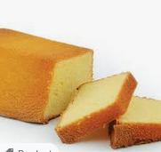

# Example Cake Recipe

Some things are just best left unaltered. This recipe makes me think of my grandma a lot.

## Information
|        |             | 
|--------|-------------|
| Serves | 4           |
| Prep   | 25 min      |
| Stand  | 0 min       |
| Bake   | 35 min      |

## Ingredients
| Ingredient | Amount       | Amount (US)    |
| :--------- | :----------- | :------------- |
| Milk       | 500 ml       | 2 Cups         | 
| Sugar      | 200 gr       | 1 cup          | 

## Instructions
- Mix everything
- Pour in tin
- Bake for 30 min at 180 &deg;C