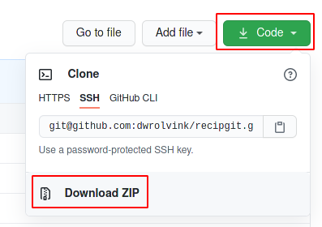
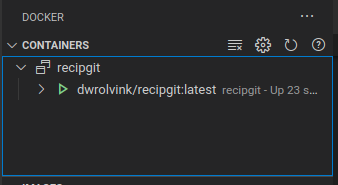

# Installation
These instructions are written with the novice in mind. 
If you are getting stuck following these instructions then that is an issue for us, 
please [open an issue](https://github.com/dwrolvink/recipgit/issues) so we can help you (and improve these instructions).

# 1. Install & configure docker and docker-compose
General instructions can be found here: [Official installation docs](https://docs.docker.com/compose/install/)

For linux, they are (seemingly too) complex, though. 
Below is an example that works on Arch/Manjaro:

```
# Install docker and docker-compose
sudo pacman -S docker docker-compose

# Start the docker service (and enable it so it starts at boot time)
sudo systemctl start docker
sudo systemctl enable docker

# Add the user to the docker group so you can run docker commands
# without sudo
sudo usermod -aG docker $USER

# Reboot is the simplest way to have your new membership be loaded
sudo systemctl start reboot.target
```

# 2. Get the code
## With git
If you have git installed, run:
```
git clone git@github.com:dwrolvink/recipgit.git
cd recipgit
```
In the folder where you want the code to end up. **Continue to step 3.**

## Without git
If you don't have git installed, follow these steps:
- Click `Code`, then `Download ZIP`   
  
- When finished downloading, open the zip file
- Unpack in a location of choice
- Open your terminal (Powershell on Windows) and navigate to the location where you unpacked the files
  - e.g. `cd C:/users/myname/Documents/recipgit` (Windows)
  - e.g. `cd ~/recipgit` (Linux)
- When you execute `ls` in your terminal, you should see the following (or similar):
  ```
  Dockerfile
  app
  book
  docker-compose.yml
  docs
  readme.md
  ```

# 3. Build image
> At a later time we will prebuild the container image, but for now you need to build it yourself.
Run the following in the same terminal as before to build the image:
```
docker build -t dwrolvink/recipgit .
```

# 4. Run container
```
docker-compose up --detach
```

> If you are using vs code, I highly reccommend installing the docker extension. This will allow you to view your running containers easily:   



# 5. Open in browser
Open the following link in your browser: [http://localhost:8080](http://localhost:8080). You should be greeted with a website.
